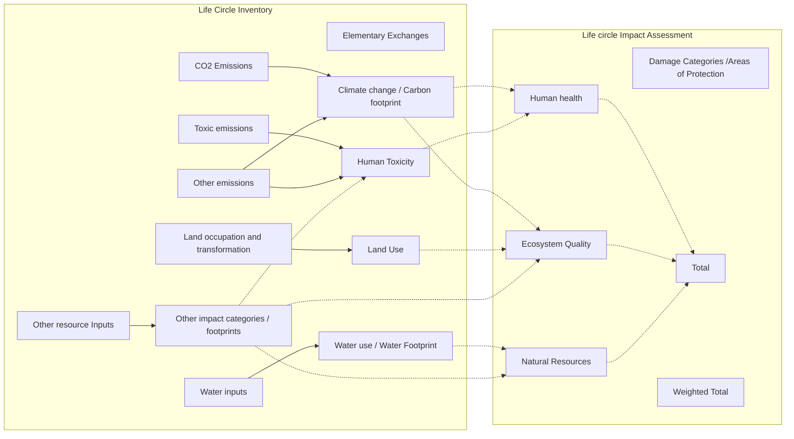

# ecological-footprint
Ecological footprint accounting in The Open Network

Ecological footprint accounting in the transactions assessment of The Open Network

## Methods 

### Input 
The "input" method files are in the form of CSV data with the following fields. Basically, the file lists all elementary flows and the characterization factors per impact category and/or indicator in columns. Preferably, method developers would provide methods in this format (including any other fields). Indicator units need to be reported in a separate file.

|Field	                  |Field type                    |Data type	  |Note                                 |
|-------------------------|------------------------------|-------------|-------------------------------------|
|elementary_flow_id  	    |recommended                   |string       |method elementary flow ID            |
|elementary_flow_name			|mandatory                     |string       |method elementary flow name          |	
|number		                |recommended if available      |string       |method elementary flow number        |		
|formula			            |recommended if available      |string       |method elementary flow formula       |	
|synonyms			            |recommended if available      |string       |synonyms for method elementary flow  |
|unit_name		            |mandatory                     |string       |method elementary flow unit name     |		
|directionality           |recommended                   |string       |method elementary flow directionality (resource or emission) |	
|compartment				      |mandatory                     |string       |method elementary flow compartment   |
|subcompartment				    |recommended                   |string       |method elementary flow subcompartment|
|{category and/or indicator 1}|mandatory where available |number       |characterization factors for a method impact category and/or indicator; if category and indicator: preferably separated by "\|" |
|...                      |                              |             |                                     |
|{category and/or indicator n}|                          |             |                                     |
|(any other field)        |optional                      |             |any other information that is available and helps to understand the method and its elementary flows|

### Mapped 
The "mapped" method files are in the form of CSV data with the following fields. They show what method elementary flows were mapped to elementary flows and can be used for reviewing method implementation.
|Field	                  |Data type	  |Note   |
|-------------------------|-------------|-------|
|elementary_flow_id   		|string       | elementary flow UUID       |
|elementary_flow_name			|string       | elementary flow name       |	
|number		            |string       | elementary flow number       |		
|formula			            |string       | elementary flow formula       |	
|synonyms			            |string       |synonyms for  elementary flow       |	
|compartment				      |string       | elementary flow compartment       |
|subcompartment				    |string       | elementary flow subcompartment        |
|unit_name		            |string       | elementary flow unit name      |		
|flow_status		          |string       |indicates whether the  elementary flow was mapped|
|flow_used				        |boolean      |indicates whether the  elementary flow is used in the  database   |
|conversion_factor        |number       |the conversion with which the original characterization factor was multiplied       |
|method_elementary_flow_id|string       |method elementary flow UUID       |
|method_elementary_flow_name|string     |method elementary flow name       |
|method_compartment       |string       |method elementary flow compartment       |
|method_subcompartment    |string       |method elementary flow subcompartment       |
|method_unit              |string       |method elementary flow unit       |
|compartment_status       |string       |indicates whether the compartment/subcompartment was mapped or not       |
|{category 1}\|{indicator 1}|number     |characterization factors of method impact category and indicator |
|...                      |             |        | 
|{category n}\|{indicator n}|           |        | 
