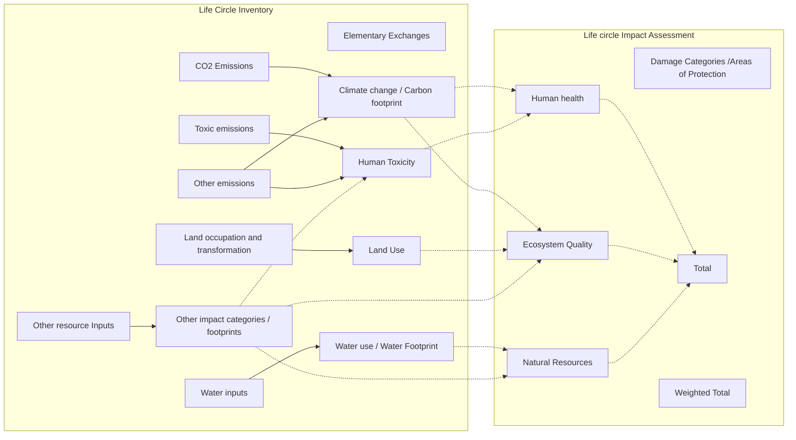

# ecological-footprint
Ecological footprint accounting in The Open Network
Ecological footprint accounting in the transactions assessment of The Open Network

## Methods 

The "input" method files are in the form of CSV data with the following fields. Basically, the file lists all elementary flows and the characterization factors per impact category and/or indicator in columns. Preferably, method developers would provide methods in this format to ecoinvent (including any other fields). Indicator units need to be reported in a separate file.

|Field	                  |Field type                    |Data type	  |Note                                 |
|-------------------------|------------------------------|-------------|-------------------------------------|
|elementary_flow_id  	    |recommended                   |string       |method elementary flow ID            |
|elementary_flow_name			|mandatory                     |string       |method elementary flow name          |	
|number		                |recommended if available      |string       |method elementary flow number        |		
|formula			            |recommended if available      |string       |method elementary flow formula       |	
|synonyms			            |recommended if available      |string       |synonyms for method elementary flow  |
|unit_name		            |mandatory                     |string       |method elementary flow unit name     |		
|directionality           |recommended                   |string       |method elementary flow directionality (resource or emission) |	
|compartment				      |mandatory                     |string       |method elementary flow compartment   |
|subcompartment				    |recommended                   |string       |method elementary flow subcompartment|
|{category and/or indicator 1}|mandatory where available |number       |characterization factors for a method impact category and/or indicator; if category and indicator: preferably separated by "\|" |
|...                      |                              |             |                                     |
|{category and/or indicator n}|                          |             |                                     |
|(any other field)        |optional                      |             |any other information that is available and helps to understand the method and its elementary flows|
